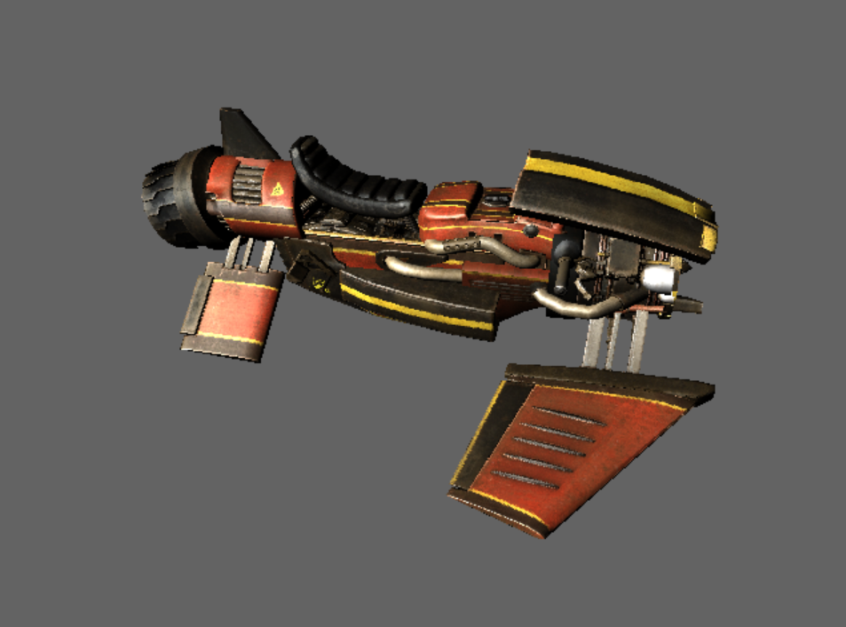

# Dual Rasterizer

A C++20 renderer that implements the same scene through two independent pipelines, switchable at runtime:

- **Software rasterizer** — a CPU-based rasterizer writing directly to a pixel buffer (triangle rasterization, depth buffering, texture sampling, and lighting all done by hand).
- **Hardware rasterizer** — a DirectX 11 pipeline using a `.fx` effect file for vertex/pixel shading.

Built on SDL2 for windowing/input and SDL2_image for texture loading.



## Features

- Toggle between software and DirectX11 rendering at runtime
- Diffuse, normal, specular, and gloss texture mapping
- Multiple render modes: observed area, diffuse only, specular only, combined
- Point, linear, and anisotropic texture sampling
- Depth buffer visualization
- Transparent mesh rendering (fire effect)
- Mesh rotation toggle
- Screenshot capture

## Controls

| Key | Action |
| --- | --- |
| `F1` | Toggle rendering backend (Software / DirectX11) |
| `F2` | Toggle mesh rotation |
| `F3` | Toggle transparent mesh rendering |
| `F4` | Toggle sampling mode (Point / Linear / Anisotropic) |
| `F5` | Toggle render mode (Observed Area / Diffuse / Specular / Combined) |
| `F6` | Toggle normal mapping |
| `F7` | Toggle depth buffer visualization |
| `F10` | Toggle uniform clear color |
| `F11` | Toggle FPS printing |
| `X` (on release) | Save a screenshot |

### Camera

| Input | Action |
| --- | --- |
| `W` / `S` (or `↑` / `↓`) | Move forward / backward |
| `A` / `D` (or `←` / `→`) | Move left / right |
| `Q` / `E` | Move down / up |
| `Left Shift` (hold) | Speed boost (5x) |
| Right mouse button + drag | Look around (yaw/pitch) + WASD movement |
| Left mouse button + drag | Move forward/backward (vertical drag) + yaw (horizontal drag) |
| Both mouse buttons + drag | Move up/down/left/right (pan) |

## Building

Requirements: CMake 3.27+, a Windows toolchain with the DirectX 11 SDK (`d3d11.lib`, `dxgi.lib`), and a C++20 compiler (Visual Studio recommended).

```
cmake -S . -B out/build/x64-Release
cmake --build out/build/x64-Release --config Release
```

The SDL2, SDL2_image, and DirectX Effects (`dx11effects`) libraries are vendored under `project/libs/` and linked automatically. Resource files (models, textures, shaders) are copied to the output directory as a post-build step.

## Project Layout

```
project/
├── src/            # Engine source (renderer, math, mesh, camera, materials, etc.)
├── resources/       # Models (.obj), textures, and the DX11 effect (.fx) file
└── libs/             # Vendored dependencies (SDL2, SDL2_image, dx11effects, vld)
```
